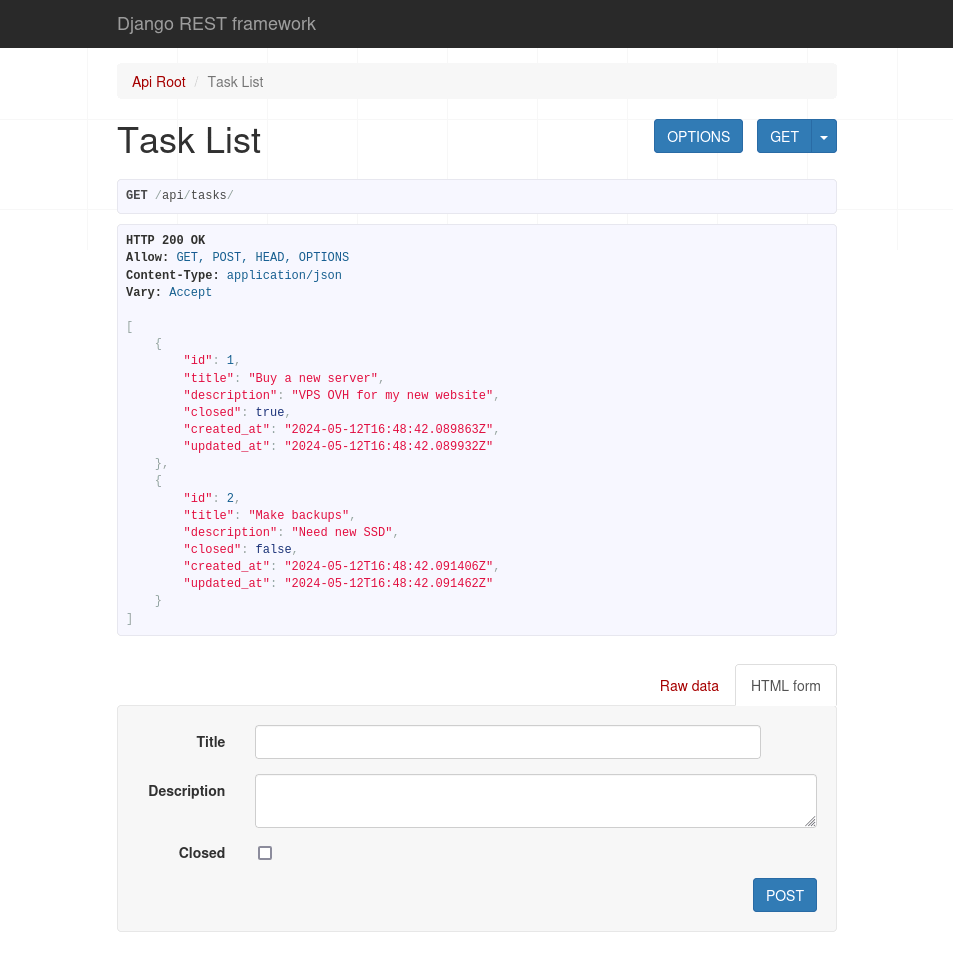

# ToDo App

Liste des tâches réalisée avec Django et Django Rest Framework (DRF)

Voici les actions qui seront disponibles:

- Lister les tâches: `GET` `/api/tasks`
- Lire une tâche précise: `GET` `/api/tasks/1/`
- Créer une tâche: `POST` `/api/tasks`
- Modifier une tâche: `PUT` `/api/tasks/1/` (tous les champs devront être modifiés)
- Modifier partiellement une tâche: `PATCH` `/api/tasks/1/`
- Effacer une tâche: `DELETE` `/api/tasks/1/`

Pour avoir le code le plus simple possible, 

- On profite du template HTML proposé par Django Rest Framework (largement suffisant pour tester le CRUD). 
- J'ai aussi volontairement omis la partie "Authentification"

## Installation

- Renommer `settings-sample.py` en `settings.py` (dossier `main`) 
- Générer et ajouter une SECRET_KEY dans les settings (voir [ici](https://djecrety.ir/), par exemple)
- Créer et activer l'environnement virtuel (peut varier selon les préférences de chacun): `python3 -m venv venv && source venv/bin/activate`

La suite est classique:

- Intégration des paquets Python: `pip install -r requirements.txt`
- Génération des fichiers de migration: `python manage.py makemigrations`
- Intégration des migrations: `python manage.py migrate`
- Lancement du serveur de développement: `python manage.py runserver 8888`

Le site est visible ici: <http://localhost:8888/tasks/>

Après avoir créé un "super user" (`python manage.py createsuperuser`), la partie "admin" sera accessible ici: <http://localhost:8888/admin/>

## Tests

J'ai aussi ajouté différents tests. Ils couvrent toutes les routes de l'API: `python manage.py test`

## Apercu

