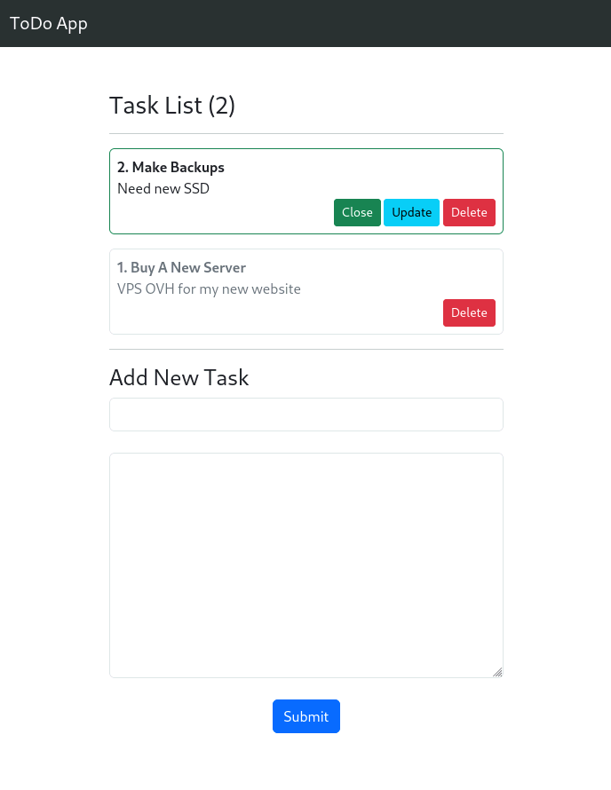

# ToDo App

Liste des tâches réalisée avec Django et Bootstrap.

## Installation

- Renommer `settings-sample.py` en `settings.py` (dossier `main`) 
- Générer et ajouter une SECRET_KEY dans les settings (voir [ici](https://djecrety.ir/), par exemple)
- Créer et activer l'environnement virtuel (peut varier selon les préférences de chacun): `python3 -m venv venv && source venv/bin/activate`

La suite est classique:

- Intégration des paquets Python: `pip install -r requirements.txt`
- Génération des fichiers de migration: `python manage.py makemigrations`
- Intégration des migrations: `python manage.py migrate`
- Lancement du serveur de développement: `python manage.py runserver`

Le site est visible ici: <http://localhost:8000>

## Apercu

